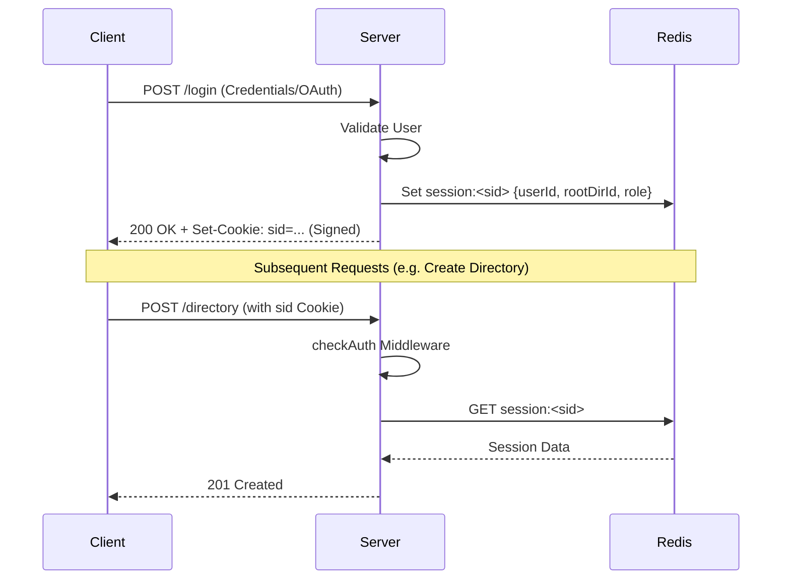
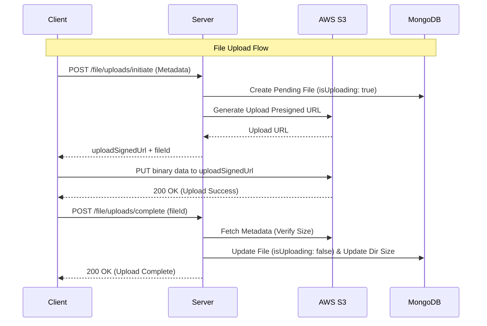
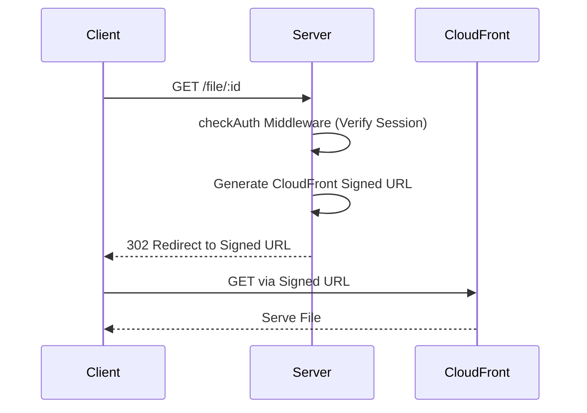

# File Storage Backend 🚀

A highly scalable, secure, and production-ready file storage backend system. It provides functionality analogous to cloud storage services like Google Drive or Dropbox. Built with Node.js, Express, and AWS S3, it features robust user authentication, directory management, and optimized large-file handling using S3 Presigned URLs.

## 🌟 Features

- **Robust Authentication:** Secure session management using signed cookies and Redis.
- **Directory Management:** Create, rename, delete, and list nested directories.
- **Optimized File Uploads:** Client-direct S3 uploads using presigned URLs to reduce server load and save bandwidth.
- **Secure File Retrieval:** Files are served via AWS CloudFront with signed URLs for secure and fast content delivery.
- **Storage Limits:** Enforces user-specific storage quotas before S3 upload initiation.
- **File Sharing:** Securely share file links via email (Nodemailer).
- **Two-Factor Authentication (2FA):** Enhanced account security using TOTP.
- **OAuth Integrations:** Support for GitHub and Google logins.

---

## 🛠️ Tech Stack

- **Framework:** Node.js, Express.js
- **Database:** MongoDB (Mongoose)
- **Caching & Session:** Redis
- **Storage & CDN:** AWS S3, AWS CloudFront
- **Validation & Security:** Zod, DOMPurify, Helmet, Rate Limiting
- **Logging:** Winston (with daily log rotation)

---

## 🔒 Authentication Flow

Authentication is managed via HTTP-only, secure **Signed Cookies** backed by **Redis** sessions.



1. **Login/Register:** Upon successful login or registration (or OAuth), the server generates a unique session ID.
2. **Session Storage:** The user's session data (including `userId`, `rootDirId`, and `role`) is stored in Redis under the key `session:<sid>`.
3. **Cookie Assignment:** The session ID is sent to the client as a signed cookie (`sid`).
4. **Auth Middleware (`checkAuth`):**
   - Extracts the `sid` from the signed cookies.
   - Verifies the session's existence in Redis.
   - Attaches the session payload (`req.user`) to the request object for downstream use.
   - Unauthorized requests are rejected with a `401` status.

---

## 📁 Directory Management

Directories can be deeply nested. Every user gets a `rootDirId` upon account creation. 

### Creating a Directory
**Endpoint:** `POST /directory/:parentDirId?`

**Authentication Required:** Yes (`checkAuth` middleware).

**How it works:**
1. The request passes through the `checkAuth` middleware, ensuring the user has a valid Redis session.
2. The `parentDirId` is extracted from the URL params. If none is provided, it defaults to the user's `rootDirId`.
3. The directory name is extracted from the `dirname` header and sanitized using `DOMPurify` to prevent XSS attacks.
4. The system verifies the existence of the parent directory.
5. A new directory document is inserted into MongoDB with a reference to its `parentDirId` and the `userId`.

---

## ☁️ File Management (Upload & Retrieval)

To ensure high performance and reduce the bottleneck on the Node.js server, file transfers (uploads/downloads) occur **directly between the client and AWS**.

### ⬆️ How Files Are Uploaded

File uploading is a two-step process utilizing **AWS S3 Presigned URLs**.



**Step 1: Initiate Upload** (`POST /file/uploads/initiate`)
1. Client sends the file's metadata (`name`, `size`, `ContentType`, `parentDirId`).
2. Server verifies if the user has enough storage quota remaining.
3. Server creates a pending `File` document in MongoDB marked as `isUploading: true`.
4. Server generates an **S3 Upload Presigned URL** valid for a specific duration.
5. Server responds with the `uploadSignedUrl` and `fileId`.

**Step 2: Client Uploads Directly to S3**
1. The client performs a `PUT` request directly to the S3 `uploadSignedUrl` using the binary file data.

**Step 3: Complete Upload** (`POST /file/uploads/complete`)
1. Client notifies the server that the S3 upload is finished, sending the `fileId`.
2. Server fetches the S3 object metadata (`ContentLength`) from AWS to verify the uploaded file size matches the initial claim.
3. If valid, the file is marked as `isUploading: false`.
4. Directory sizes are recursively updated (`updateDirectoriesSize`) to reflect the new storage usage.

### ⬇️ How Files Are Retrieved



**Endpoint:** `GET /file/:id`

1. Client requests a file using its `id`.
2. Server queries MongoDB to ensure the file exists and belongs to the authenticated user.
3. Server generates an **AWS CloudFront Signed URL**.
   - If `?action=download` is appended, the CloudFront URL is configured with headers to force a file download (`Content-Disposition: attachment`).
   - Otherwise, it is configured for inline viewing.
4. Server issues a `302 Redirect` to the generated CloudFront Signed URL.
5. The client downloads/views the file securely and directly from the edge CDN.

---
## 🚀 Setup & Installation

1. **Clone the repository**
2. **Install dependencies:**
   ```bash
   npm install
   ```
3. **Run setup script (Optional database setup):**
   ```bash
   npm run setup
   ```
4. **Start the development server:**
   ```bash
   npm run dev
   ```

## 📜 License
ISC License
